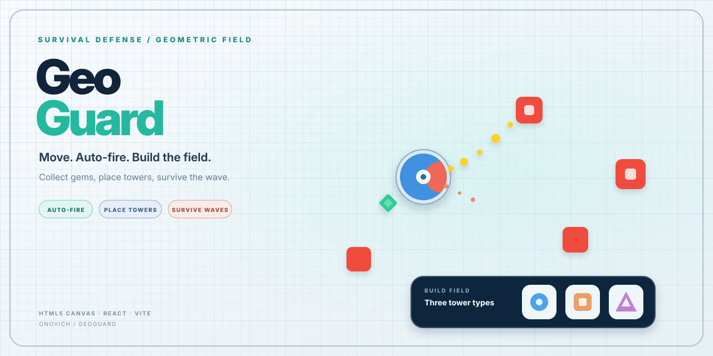

# GeoGuard

[简体中文](README.zh-CN.md)

[Play online](https://blog.onovich.com/GeoGuard/)

GeoGuard is a browser survival-defense game about moving through a geometric battlefield, collecting resources, and building a tower network while enemy waves close in.



## How to play

- Move with `WASD` or the arrow keys. The player attacks nearby enemies automatically.
- On mobile, press and hold an empty part of the field to move.
- Collect the gems dropped by enemies.
- Drag a tower card from the build bar onto the battlefield to place it.
- Survive each wave, choose rewards, and prepare for boss encounters.

## Features

- Real-time survival movement with automatic attacks.
- Multiple tower blueprints, placement rules, upgrades, and contextual tower actions.
- Data-driven enemy waves, rewards, progression, encounters, and boss phases.
- Canvas-rendered battlefield with a React HUD and build interface.
- Desktop and touch controls, audio settings, and responsive layout.
- Automated gameplay-rule, architecture, and UI design-system tests.

## Development

Install dependencies and start the Vite server:

```bash
npm install
npm run dev
```

Run the test suite and production build:

```bash
npm test
npm run build
```

Run the focused architecture and UI standards checks:

```bash
npm run check:architecture
```

On Windows, `StartGeoGuard.cmd` starts the local project.

## Project structure

- `src/data/` contains tower, enemy, wave, reward, and presentation data.
- `src/logic/engine/` contains reusable gameplay rules and runtime systems.
- `src/logic/hooks/` connects the engine loop, browser input, audio, and React state.
- `src/view/` contains the Canvas renderer, HUD, build bar, and overlays.
- `origin/` preserves the original prototype and design notes.

## Status

The current web build contains a playable survival, tower-building, reward, wave, and boss loop. GeoGuard is still a prototype: balance, content breadth, long-session behavior, and production deployment across target devices need further validation.

## License

No open-source license is currently included in this repository.
