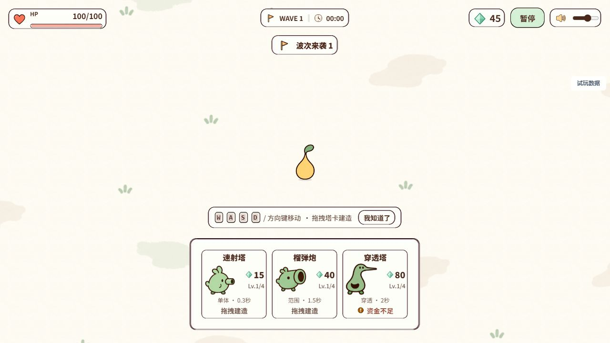

# 最终电脑端美术修复验收

2026-10-07。实施者仅 ui_overlays_fix，主审负责诊断、退回与复验。当前候选内部验收通过，等待用户最终美术验收。本轮未提交或推送。

全部 AR01–06、VF 对应项、D01–05 已按下述证据范围关闭。图标、按钮、面板、装饰、角色、弹体与粒子使用原稿像素切片或明确登记的正式AI补充；程序仅承担布局、变换、实体逻辑和真实功能几何。来源失败显式停止，无静默自绘或旧稿替代。切片、抠图、九宫格、纹理重映射和中性姿态派生均在来源记录中说明，不能视作独立原画动作。

## 验收证据

- [逐轮退回与复验](../../../acceptance-ledger.md)：包括长炮口连续性、近身弹体、脚部root、召唤物独立生命/清理、缺件缓存错误、建造栏原稿边缘与提示遮挡。失败版本保留，不作为通过证据。
- 48身份四朝向八采样时点，共1536实际绘制样本；SHIELD脚部偏移退回后32样本复验通过。375动作映射是结构覆盖，不代表375套独立动画，也不代表所有升级等级均完整实战。
- 95技能/380适用阶段原稿映射；双子死亡后的存活者狂暴、COMMANDER/HIVE/SPIDER独立召唤UID/HP/期限/死亡与owner清理实际验证。未观察到的基本HIVE/SPIDER攻击状态不虚报。
- 长炮口288真实发射样本与32原生截图，额外障碍近身源射线例外复验；独立弹体、选定目标与碰撞结果保持。7圆炮塔231发射样本、50规则边界和400侧偏样本保留。允许的炮口出生/瞄准适配有明确边界；未改Boss AI、经济、HP、伤害和碰撞体系。
- 960/1280/1440/2304电脑布局；首末卡、键盘定位、17px取消、资金不足、真实付费、暂停/奖励清拖、ghost落点、奖励变体与正常奖励链通过。最终三卡完整显示且无需横滚，教程与底栏间留28px。测试使用公开DOM真实事件适配，不能宣称原生持续鼠标按压已测。
- [生产资源实际解码](final-production-decode.json)：311 PNG逐一HTTP读取与完整解码、SHA/尺寸匹配；76来源记录、321源文件哈希关系校验。长炮口16部件处理独立重放哈希完全一致。82MB解码估算不等于实测GPU内存。
- [最终真实normal1800帧](final-normal-auto-profile.json)：实际三塔扣费45→30→15→0，30.0758秒时自动保留1800可见活跃帧；draw平均0.525ms、p95 0.8ms、最大1.7ms，update p95 0.2ms。此前人工读取太晚的失败收据保留，未计为通过。
- 同候选高密度720真实帧：DPR1 draw p95 4.5ms；显式2倍backing draw p95 4.9ms。首次组合存在约48–53ms单帧峰值。2倍backing仅验证渲染器，未获得真实DPR2硬件完整React UI证据；JS堆统计不含原生/GPU图像。
- 最终169/169测试通过、架构11/11通过、生产构建通过；构建有大包警告。来源错误与缺部件暖缓存均有负向实际验收。

## 用户验收

运行 npm run dev，打开游戏与完整画册对照。重点查看普通战斗、转向与近身发射、九塔、Boss特征、奖励面板和高密度辨识度。本报告是电脑端候选内部通过，不代替用户审美确认；手机端及开发测试界面包装不在本轮范围。

